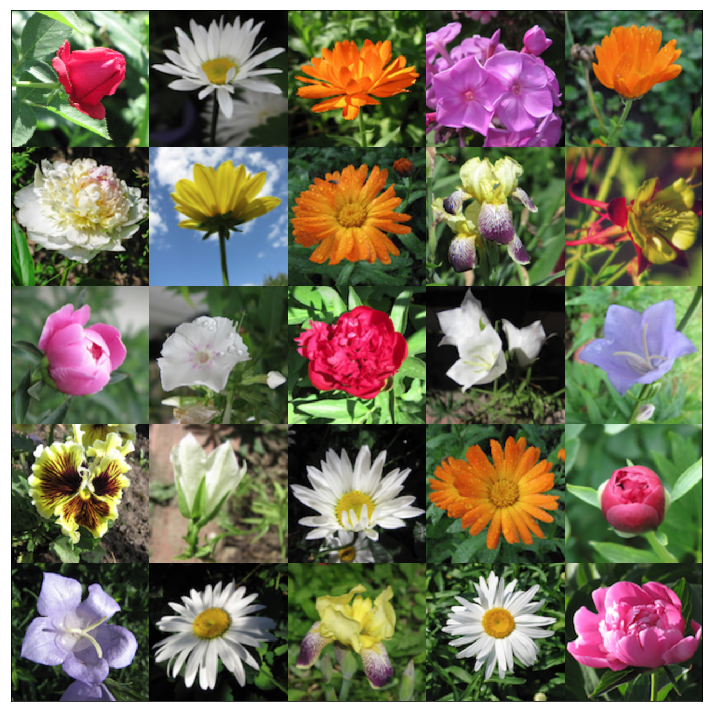
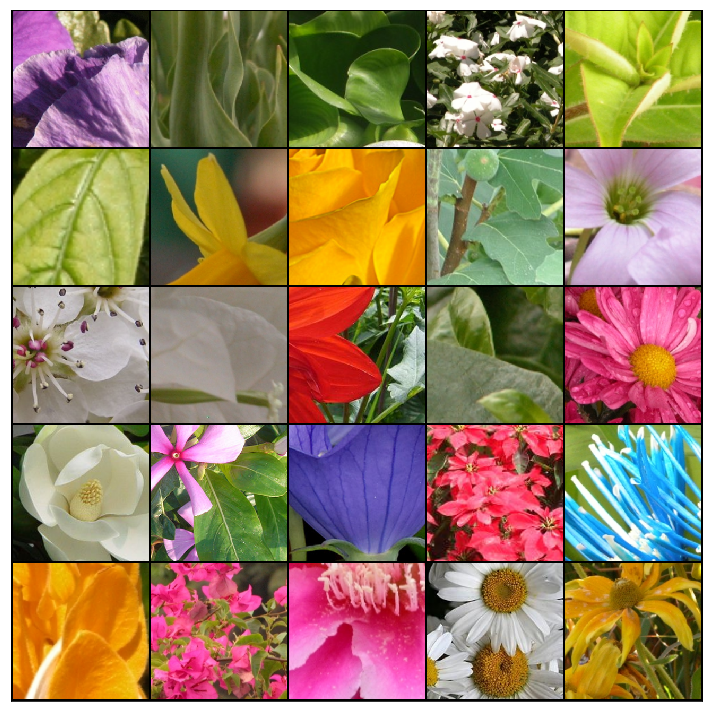
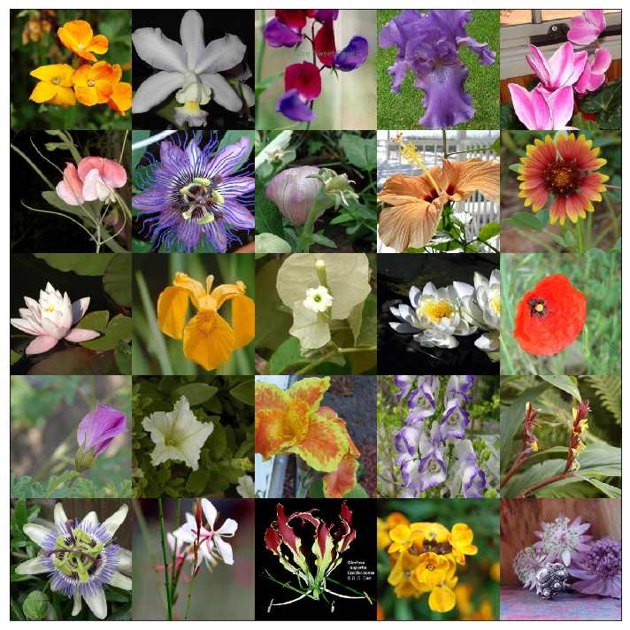

<h1 align="center">flower-garden</h1>

<p align="center">
  =3.12">
  
  
</p>

A zoo of image generation models applied to flower images.

## Getting started

### Requirements

- Git
- uv
- Python >=3.12
- Docker, optional but recommended for the container workflow
- NVIDIA Container Toolkit, optional and only required for `DEVICE=gpu`

First, clone the repository:

```bash
git clone https://github.com/Henley13/flower-garden.git
cd flower-garden
```

Then, install the dependencies in a dedicated environment. You can use uv or Docker.
The CPU environment is the default.
The GPU environment requires NVIDIA Container Toolkit.

### Local environment

Create a local uv environment. CPU dependencies are included by default:

```bash
uv sync --group dev --group notebook
```

For a GPU environment:

```bash
uv sync --no-group cpu --group gpu --group dev --group notebook
```

Install pre-commit hooks:

```bash
uv run pre-commit install --hook-type pre-commit --hook-type commit-msg
```

Run pre-commit on all files:

```bash
uv run pre-commit run --all-files
```

### Docker

Build and open a shell in the CPU-only development image:

```bash
make dev
```

Build and open a shell in the CPU runtime image:

```bash
make runtime
```

Launch Jupyter Notebook:

```bash
make notebook
```

Use another notebook port:

```bash
make notebook port=8890
```

Build and open a shell in the GPU runtime image:

```bash
make runtime DEVICE=gpu
```

Launch Jupyter Notebook with GPU support:

```bash
make notebook DEVICE=gpu
```

## Datasets

[Dataset 1 (Flower Color Images in Kaggle)](https://www.kaggle.com/olgabelitskaya/flower-color-images)

- 210 png images with a good quality.
- 10 species of flowers:
    - Phlox
    - Rose
    - Calendula
    - Iris
    - Leucanthemum maximum
    - Bellflower
    - Viola
    - Rudbeckia laciniata (Goldquelle)
    - Peony
    - Aquilegia



[Dataset 2 (T91 Image Dataset in Kaggle)](https://www.kaggle.com/ll01dm/t91-image-dataset)

- 55 cropped png images of flowers with a good quality.



[Dataset 3 (102 Category Flower Dataset in Oxford)](http://www.robots.ox.ac.uk/~vgg/data/flowers/102/index.html)

- 8189 jpg images potentially with text inside.
- 102 flower categories (between 40 and 258 images per class).


