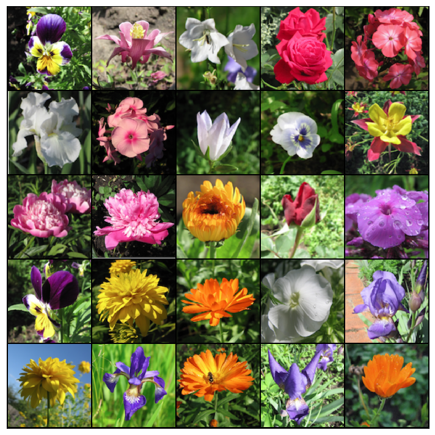
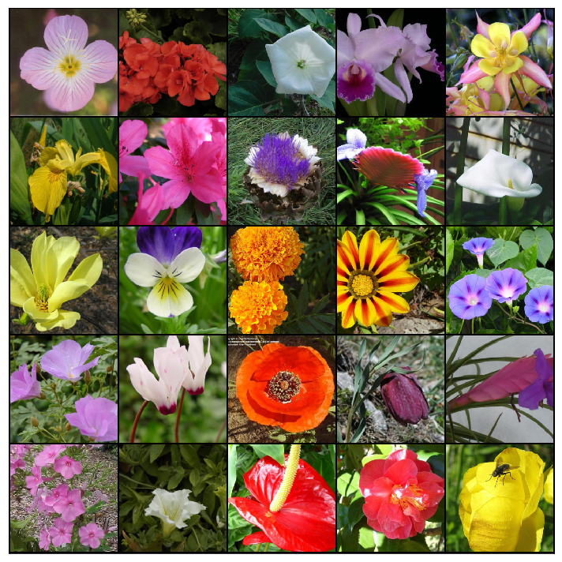

# flower-garden
Some generative models implemented with flower images !

__Datasets__: 

[Dataset 1 (Flower Color Images in Kaggle)](https://www.kaggle.com/olgabelitskaya/flower-color-images)

- 210 png images with a good quality.
- 10 species of flowers:
    - Phlox
    - Rose
    - Calendula
    - Iris
    - Leucanthemum maximum
    - Bellflower
    - Viola
    - Rudbeckia laciniata (Goldquelle)
    - Peony
    - Aquilegia

[Dataset 2 (T91 Image Dataset in Kaggle)](https://www.kaggle.com/ll01dm/t91-image-dataset)

- 55 cropped png images of flowers with a good quality.

[Dataset 3 (102 Category Flower Dataset in Oxford)](http://www.robots.ox.ac.uk/~vgg/data/flowers/102/index.html)

- 8189 jpg images potentially with text inside.
- 102 flower categories (between 40 and 258 images per class).

